<picture>
  <source media="(prefers-color-scheme: dark)" srcset="assets/hero-dark.svg">
  
</picture>

# agents

My agent setup: one instruction file and 40 skills, shared by Claude Code, Codex and Cursor from a single folder.

The instructions ([`AGENTS.md`](AGENTS.md)) are in Portuguese; they are written for me and the agents I work with. The structure and the scripts are the part worth copying.

## How it loads

Each harness reads the same files through symlinks that [`bin/ensure-redirects`](bin/ensure-redirects) creates:

| Harness | Instructions | Skills |
|---|---|---|
| Claude Code | `~/.claude/CLAUDE.md` → `AGENTS.md` | `~/.claude/skills` → `skills/` |
| Codex | `~/.codex/AGENTS.md` → `AGENTS.md` | — |
| Cursor | `~/.cursor/rules/gui-agents.mdc` (`alwaysApply`, `@`-includes `AGENTS.md`) | `~/.cursor/skills` → `skills/` |

Cursor has no global `AGENTS.md`, so the script writes a one-file rule that points at it.

## Layout

```
~/.agents/
  AGENTS.md            instructions, always on
  own/<skill>/         skills I wrote
  vendor/<source>/     third-party skills, copied in, with their LICENSE
  skills/              generated: flat symlinks to own/ and vendor/ (harnesses don't recurse)
  bin/ensure-redirects
  assets/              README images, generated by assets/build.py
```

`skills/` is gitignored and rebuilt on every run. Harnesses only look one level deep, so the script flattens `own/` and `vendor/<source>/` into it and warns if a real folder lands there, which is what `npx skills add --copy` does.

## New machine

```bash
gh repo clone rodniski/agents ~/.agents
~/.agents/bin/ensure-redirects
```

The script also clones the skills that live in their own repos (today, [humanizing](https://github.com/rodniski/humanizing)) into `own/`. Run it again after adding or removing a skill.

## Skills

| Source | Skills | License |
|---|---|---|
| own | [humanizing](https://github.com/rodniski/humanizing), [secure-by-design](own/secure-by-design/SKILL.md) | MIT |
| [emilkowalski/skills](https://github.com/emilkowalski/skills) | 13: design engineering and motion (`emil-design-eng`, `animate`, `apple-design`, `write-swift`…) | MIT |
| [greensock/gsap-skills](https://github.com/greensock/gsap-skills) | 7: `gsap-core`, `gsap-timeline`, `gsap-scrolltrigger`… | MIT |
| [mattpocock/skills](https://github.com/mattpocock/skills) | 7: `grilling`, `wayfinder`, `tdd`, `diagnosing-bugs`, `codebase-design`, `writing-for-agents`, `handoff` | MIT |
| [Leonxlnx/taste-skill](https://github.com/Leonxlnx/taste-skill) | 5: `design-taste-frontend`, `redesign-existing-projects` and three direction presets | MIT |
| [iart-ai/web-animation-skills](https://github.com/iart-ai/web-animation-skills) | 3: `svg-animation`, `page-transition-animation`, `accessible-animation` | MIT |
| [nextlevelbuilder/ui-ux-pro-max-skill](https://github.com/nextlevelbuilder/ui-ux-pro-max-skill) | `ui-ux-pro-max` | MIT |
| [jakubkrehel/skills](https://github.com/jakubkrehel/skills) | `break` | MIT |
| [theclaymethod/unslop](https://github.com/theclaymethod/unslop) | `unslop` | MIT, per its `SKILL.md` |

Local changes to vendored skills: the five taste-skill skills, `grilling` and `wayfinder` have Portuguese descriptions; `break` is model-invoked instead of invocation-only; `ui-ux-pro-max` has its script path pointed at `~/.agents/skills/`. The rest are upstream copies as of the day they were added, so they may lag behind.

`AGENTS.md` lists every skill with its trigger and adds the usage rules the skills don't carry themselves, such as which one wins when two disagree.

## Adding or updating a skill

Third-party:

```bash
npx skills add <owner>/<repo> -g -s '<skill>' -a claude-code --copy -y
mv ~/.agents/skills/<skill> ~/.agents/vendor/<source>/
~/.agents/bin/ensure-redirects
```

Then add a row to the skills table in `AGENTS.md` and copy the upstream `LICENSE` into `vendor/<source>/` if it is a new source.

My own: create `own/<skill>/SKILL.md`, or add the repo to the clone list at the top of `bin/ensure-redirects` if it lives elsewhere.

## Conventions

- `description` says **when** to use the skill, as triggers. What the skill is goes in the body.
- Skills are model-invoked. `disable-model-invocation: true` is only for destructive workflows like deploys.
- A project's own `AGENTS.md`, skills and design system beat this folder. Product specifics stay in the product repo.

## License

My files (`AGENTS.md`, `bin/`, `own/`) are [MIT](LICENSE). Each folder in `vendor/` keeps its upstream license.
